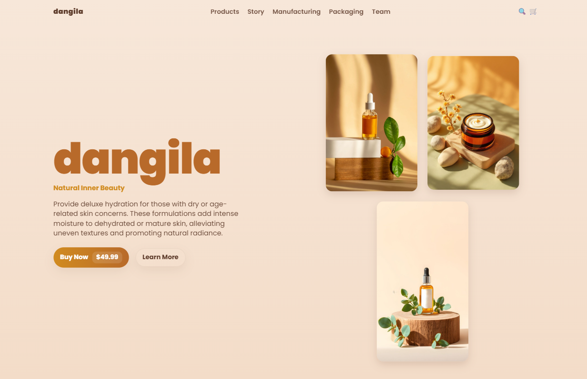

# HTML-CSS-PRACTICE

A comprehensive collection of HTML and CSS practice projects covering fundamental to advanced web development concepts.

## 📁 Project Structure

```
HTML-CSS-PRACTICE/
├── images/
│   ├── product-main.jpeg
│   ├── product-side.jpeg
│   └── product-tile.jpeg
├── Project/
│   ├── landing-page.css
│   └── landing-page.html
├── Theory/
│   └── Theory Html-Css.pdf
└── Topics/
    ├── css-specificity-cascade.html
    ├── css-units.html
    ├── flexbox-grid-positioning.html
    ├── forms-validation.html
    ├── responsive-design.html
    └── semantic.html
```

## 🎯 Topics Covered

### 1. **CSS Specificity & Cascade**
Understanding how CSS rules are applied and prioritized based on specificity, inheritance, and the cascade.

### 2. **CSS Units**
Exploration of different CSS measurement units including:
- Absolute units (px, pt, cm)
- Relative units (em, rem, %, vh, vw)
- When to use each unit type

### 3. **Flexbox, Grid & Positioning**
Modern layout techniques including:
- Flexbox for one-dimensional layouts
- CSS Grid for two-dimensional layouts
- Positioning (static, relative, absolute, fixed, sticky)

### 4. **Forms & Validation**
Creating and validating HTML forms with:
- Input types and attributes
- Client-side validation
- Form accessibility best practices

### 5. **Responsive Design**
Building mobile-friendly websites using:
- Media queries
- Responsive units
- Mobile-first approach
- Flexible layouts

### 6. **Semantic HTML**
Writing meaningful, accessible HTML using:
- Semantic elements (header, nav, main, article, section, footer)
- Proper document structure
- SEO and accessibility improvements

## 🚀 Main Project

### Dangila Landing Page

A beautiful landing page for a natural beauty product brand, combining all learned concepts:

**Technologies Used:**
- HTML5
- CSS3
- Flexbox/Grid layouts
- Responsive design principles

##  Screenshot 

*Dangila - Natural Inner Beauty Landing Page*

## 📚 Learning Resources

The `Theory` folder contains comprehensive PDF documentation covering HTML and CSS fundamentals and advanced topics.

## 🛠️ How to Use

1. Clone the repository:
   ```bash
   git clone https://github.com/shekhawatmuskan/html-css-practice.git
   ```

2. Navigate to the project directory:
   ```bash
   cd html-css-practice
   ```

3. Open any HTML file in your browser to view the examples:
   ```bash
   # For individual topics
   open Topics/flexbox-grid-positioning.html
   
   # For the main landing page
   open Project/landing-page.html
   ```


**Happy Coding! 💻✨**